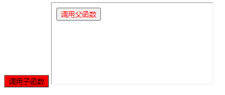

## iframe父子传参通信

### 前置知识
保证文档和资源加载完成两种方式： 1.readyState 2.onload
1. `sonWindow.document.readyState === 'complete'`
2. `sonWindow.onload = function () {}`


父获取子window
```html
<iframe name ='iframeName' id = 'iframeId>
sonWindow == iframeName == document.getElementById('iframeId').contentWindow
```

子获取父window
`window.parent`


### 案例食用

f为父文件，s为子文件

以下文件为不支持跨域的：
非跨域父子相互调用函数并传参
非跨域父子相互获取页面元素

> 此文件内的html文件，双击打开会报错，需要在服务器下打开，可使用vscode的open with live server


以下文件为支持跨域的：
跨域postMessage父子相互传参

> 可以双击文件打开


